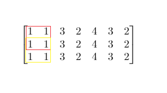
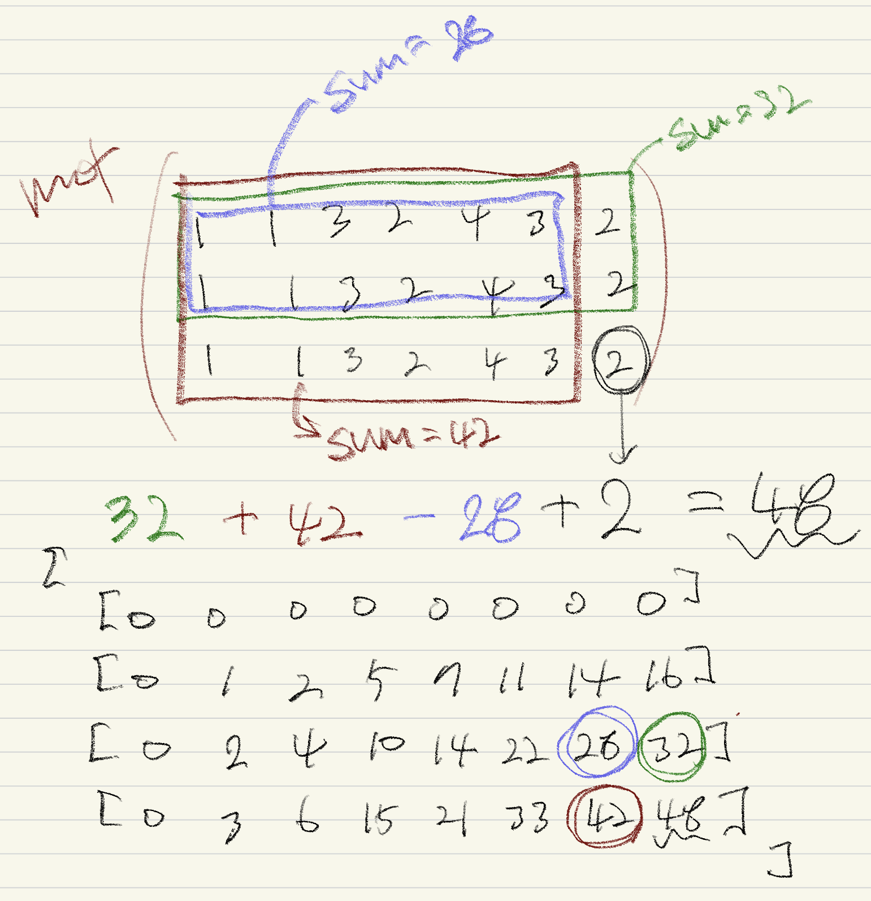

# Maximum side length of a square with sum less than or equal to threshold

## 문제
Given a m x n matrix mat and an integer threshold, return the maximum side-length of a square with a sum less than or equal to threshold or return 0 if there is no such square.

주어진 m x n 행렬 mat과 정수 threshold가 주어진다.
threshold보다 합이 적거나 같은 정사각형의 최대 한 변의 길이를 반환하거나 그런 정사각형이 없으면 0을 반환한다.

## 입력
- m == mat.length
- n == mat[i].length
- 1 <= m, n <= 300
- 0 <= mat[i][j] <= 104
- 0 <= threshold <= 105

## 출력
<!-- 출력 형식 -->

## 예제

### 입력 1

```python
mat = [
    [1,1,3,2,4,3,2],
    [1,1,3,2,4,3,2],
    [1,1,3,2,4,3,2]
    ]
threshold = 4
```

### 출력 1
```python
2
```

### 입력 2
```python
mat = [[2,2,2,2,2],[2,2,2,2,2],[2,2,2,2,2],[2,2,2,2,2],[2,2,2,2,2]]
threshold = 1
```

### 출력 2
```python
0
```

## 풀이

### 접근
<!-- 문제 해결 전략 -->

### 시간 복잡도
<!-- 분석 -->

## 코드

```python
import sys
input = sys.stdin.readline

def solve():
    pass

if __name__ == "__main__":
    solve()
```

## 회고
### 누적합 테이블 개념


